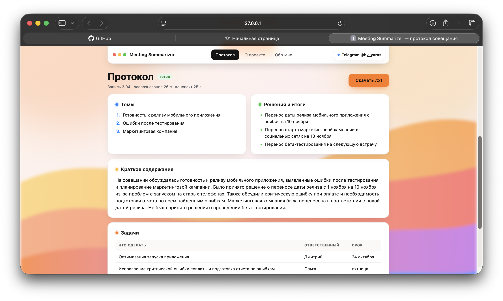

# Meeting Summarizer

Сервис, который превращает аудиозапись совещания в готовый протокол: темы, итоги, задачи и полная расшифровка.

*Local AI service that turns a meeting recording into structured minutes (Whisper + LLM).*




## Какую задачу решает

Пришли на встречу, включили диктофон на телефоне — и больше не отвлекаетесь на заметки. После встречи загружаете запись и примерно через минуту получаете протокол: о чём говорили, что решили и кто что делает к какому сроку.

## Почему я это сделал

Идея появилась на встрече сообщества ODS в Москве. Мы с парой участников разговорились о задачах на стыке NLP и звука, а потом — о том, как было бы удобно не записывать важные моменты разговора вручную, ничего не упустить и не вспоминать потом, о чём шла речь, а просто получить краткий конспект.

## Как это работает

1. **Распознавание речи.** Нейросеть Whisper переводит звук в текст.
2. **Анализ нейросетью.** Языковая модель читает текст и выделяет темы, решения и задачи.
3. **Протокол.** Результат появляется на странице, его можно скачать одним файлом.

## Особенности

- **Бесплатно и полностью на вашем компьютере** — без платных сервисов и подписок.
- **Записи никуда не отправляются и не хранятся** — файл удаляется сразу после обработки.
- **Русский язык** — распознавание и протокол на русском.
- **Голосовые из Telegram** — можно загрузить как есть, вместе с MP3, M4A и WAV.
- **Протокол скачивается одной кнопкой** в формате `.txt`.

## Пример результата

```
ЗАДАЧИ
- Задача: Оптимизация запуска приложения | Ответственный: Дмитрий | Срок: 24 октября
- Задача: Исправление критической ошибки соплаты и подготовка отчета по ошибкам | Ответственный: Ольга | Срок: пятница
- Задача: Обновление скриншотов приложения в магазине приложений | Ответственный: не указано | Срок: до релиза
```

Полный протокол: [`examples/example_result.txt`](examples/example_result.txt) · сценарий тестовой записи: [`examples/test_meeting_script.txt`](examples/test_meeting_script.txt)

## Технологии

Python 3.12 · FastAPI · faster-whisper (small, int8) · Ollama + gemma3:4b · HTML/CSS/JS без фреймворков

## Быстрый запуск (macOS)

```bash
brew install python@3.12 ollama
git clone https://github.com/LYNORR/meeting-summarizer.git && cd meeting-summarizer
python3.12 -m venv .venv && source .venv/bin/activate && pip install -r requirements.txt
ollama serve                 # в отдельном окне терминала, не закрывать
ollama pull gemma3:4b
uvicorn app.main:app         # затем открыть http://127.0.0.1:8000
```

Первый запуск скачивает модели (~3.8 ГБ), дальше всё работает без интернета. Подробная установка, устройство проекта и разбор решений — в [README_DETAILED.md](README_DETAILED.md).

## Автор

**Ярослав Жежу**, Data Scientist — [GitHub LYNORR](https://github.com/LYNORR) · Telegram [@by_yaros](https://t.me/by_yaros)
