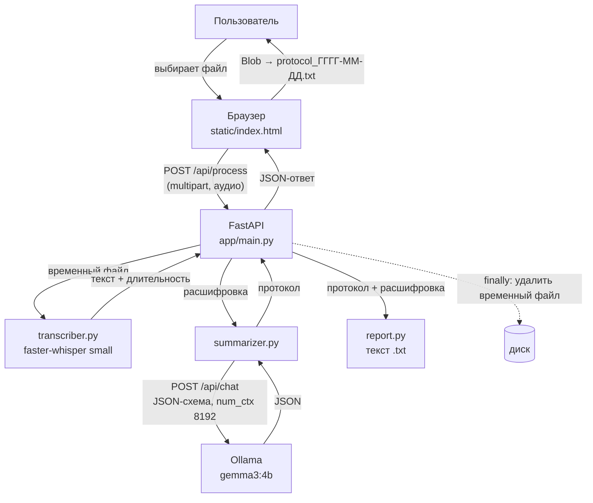

# Meeting Summarizer — подробный разбор

Этот документ — учебник по проекту: как он устроен, почему сделан именно так и что отвечать на собеседовании. Короткая версия для первого знакомства — в [README.md](README.md).

## Содержание

1. [Рассказ о проекте за 1 минуту](#1-рассказ-о-проекте-за-1-минуту)
2. [Словарь терминов](#2-словарь-терминов)
3. [Архитектура](#3-архитектура)
4. [Разбор каждого файла](#4-разбор-каждого-файла)
5. [Почему так, а не иначе](#5-почему-так-а-не-иначе)
6. [Установка с нуля на macOS](#6-установка-с-нуля-на-macos)
7. [Как проверить, что всё работает, и частые ошибки](#7-как-проверить-что-всё-работает-и-частые-ошибки)
8. [Замеры](#8-замеры)
9. [Ограничения](#9-ограничения)
10. [Как масштабировать при наличии ресурсов](#10-как-масштабировать-при-наличии-ресурсов)
11. [Вопросы с собеседования](#11-вопросы-с-собеседования)

---

## 1. Рассказ о проекте за 1 минуту

> Я сделал локальный веб-сервис, который превращает аудиозапись совещания в протокол: темы, решения, задачи с ответственными и сроками и полную расшифровку. Идея появилась на встрече сообщества ODS — обсуждали, как было бы удобно не отвлекаться на заметки во время разговора.
>
> Пайплайн из двух моделей. Сначала faster-whisper распознаёт русскую речь, затем локальная LLM gemma3:4b через Ollama извлекает из расшифровки структурированный протокол. Чтобы маленькая модель не ломала формат, я использую structured output — ответ ограничен JSON-схемой. Бэкенд на FastAPI, фронтенд — один HTML-файл без фреймворков.
>
> Всё работает бесплатно на MacBook Air с 8 ГБ памяти, запись никуда не отправляется. Трёхминутная запись обрабатывается примерно за минуту.
>
> Самое интересное — работа с качеством. Я сделал тестовую запись с заранее известными ответами и «ловушками»: задача без ответственного, задача без срока, отложенный вопрос. На ней улучшил промпт за три итерации и сравнил две модели — qwen2.5:3b и gemma3:4b. Gemma меньше выдумывает при той же скорости, её и выбрал. Ограничения описал честно: маленькая модель иногда додумывает сроки.

---

## 2. Словарь терминов

| Термин | Простыми словами | Пример в проекте |
|---|---|---|
| **ASR** (Automatic Speech Recognition) | Автоматическое распознавание речи: звук → текст | Шаг 1 пайплайна |
| **Whisper** | Модель распознавания речи от OpenAI, обученная на 680 тыс. часов аудио на многих языках | Модель `small`, хорошо знает русский |
| **faster-whisper** | Переписанный Whisper на движке CTranslate2: в несколько раз быстрее и экономнее по памяти при той же точности | `app/transcriber.py` |
| **LLM** (Large Language Model) | Большая языковая модель: по тексту предсказывает продолжение, умеет следовать инструкциям | gemma3:4b составляет протокол |
| **Токен** | Кусочек текста, с которым работает модель: слово, часть слова или знак. В русском на слово приходится 1–3 токена | 3 минуты речи ≈ 1 000 токенов вместе с инструкцией |
| **Контекстное окно** | Сколько токенов модель «видит» за раз: инструкция + текст + ответ. Всё, что не влезло, отбрасывается | `num_ctx = 8192` |
| **Квантизация** | Хранение весов модели с меньшей точностью: вместо 16–32 бит на число — 8 (int8) или 4 (Q4). Модель становится в 2–4 раза легче и быстрее, качество падает немного | Whisper в `int8`, gemma3:4b в Q4 (3.3 ГБ) |
| **Промпт** | Текст-задание для модели | «Составь протокол строго по тексту…» |
| **Системный промпт** | Особое сообщение с ролью и правилами, которое модель учитывает сильнее обычного. Пишется один раз, а данные идут отдельным сообщением | `SYSTEM_PROMPT` в `summarizer.py` |
| **Temperature** | «Смелость» модели. 0 — всегда самый вероятный ответ, 1 — разнообразно и творчески. Для фактов нужна низкая | `0.2` — меньше выдумок |
| **Structured output / JSON-схема** | Описываем нужную структуру ответа (поля и типы), и движок не даёт модели написать ничего другого | `SCHEMA` с полями topics, summary, tasks, decisions |
| **VAD** (Voice Activity Detection) | Определение, где в записи речь, а где тишина | `vad_filter=True` вырезает паузы |
| **Галлюцинации модели** | Уверенно сформулированная выдумка. Whisper на тишине «слышит» фразы вроде «Продолжение следует…», LLM додумывает сроки и имена | Лечим VAD, промптом и низкой температурой |
| **Инференс** | Использование готовой модели для получения ответа (в отличие от обучения) | Весь проект — только инференс |
| **API** | Договорённость, как одна программа обращается к другой | Страница общается с сервером, сервер — с Ollama |
| **Эндпоинт** | Конкретный адрес API, который что-то делает | `POST /api/process` |
| **REST** | Стиль API поверх HTTP: ресурсы по адресам и стандартные методы (`GET` — получить, `POST` — отправить) | `GET /api/health`, `POST /api/process` |
| **multipart/form-data** | Формат HTTP-запроса для отправки файлов | Так браузер отправляет аудиофайл |
| **FastAPI** | Python-фреймворк для создания API: маршруты, проверка данных, документация | `app/main.py` |
| **Uvicorn** | Веб-сервер, который запускает FastAPI-приложение и принимает HTTP-запросы | `uvicorn app.main:app` |
| **Ollama** | Программа, которая скачивает и запускает LLM локально и даёт к ним HTTP-API | `localhost:11434` |
| **venv** | Виртуальное окружение — отдельная папка с Python и библиотеками только для этого проекта | `.venv/` |

---

## 3. Архитектура



### Путь данных: от нажатия кнопки до скачивания файла

1. **Выбор файла.** Страница сразу проверяет расширение (`.mp3`, `.m4a`, `.wav`, а также `.ogg`/`.oga` — так Telegram сохраняет голосовые сообщения) и размер (до 50 МБ). Неподходящий файл даже не уходит на сервер.
2. **Отправка.** По кнопке «Сделать протокол» браузер отправляет файл запросом `POST /api/process` в формате multipart. Кнопка блокируется, чтобы не отправить запись дважды, запускается таймер.
3. **Проверки на сервере.** `main.py` ещё раз проверяет расширение и спрашивает Ollama, запущена ли она и скачана ли модель. Если нет — ошибка 503 сразу, а не через минуту распознавания.
4. **Временный файл.** Whisper читает аудио с диска, поэтому загрузка сохраняется во временный файл. Проверяется, что он не пустой и не больше 50 МБ.
5. **Распознавание.** `transcriber.py` проверяет длительность (до 15 минут), вырезает тишину и превращает речь в текст. Пустой результат (тишина, музыка) — ошибка «Речь не распознана», LLM не вызывается.
6. **Конспект.** `summarizer.py` отправляет расшифровку в Ollama с системным промптом и JSON-схемой. Если ответ не разобрался — одна повторная попытка.
7. **Сборка протокола.** `report.py` собирает текстовый файл: темы, содержание, решения, задачи, расшифровка.
8. **Удаление.** Временный файл удаляется в блоке `finally` — даже если на любом шаге случилась ошибка.
9. **Показ и скачивание.** Браузер показывает карточки результата. Кнопка «Скачать .txt» собирает файл прямо в браузере (Blob) — на сервере он не создаётся.

---

## 4. Разбор каждого файла

```
meeting-summarizer/
├── app/
│   ├── config.py        # все настройки в одном месте
│   ├── transcriber.py   # аудио → текст
│   ├── summarizer.py    # текст → протокол (JSON)
│   ├── report.py        # протокол → .txt
│   └── main.py          # веб-сервер: маршруты, проверки, удаление файла
├── static/index.html    # страница: HTML + CSS + JS в одном файле
├── index.html           # перенаправление на страницу для демо на GitHub Pages
├── examples/            # тестовый сценарий и реальный результат
├── docs/screenshots/    # скриншоты для README
└── requirements.txt     # зависимости с закреплёнными версиями
```

### `app/config.py` — настройки

Все модели, адреса и лимиты в одном файле. Чтобы перейти на другую модель, меняется одна строка — это и есть ответ на вопрос «как масштабировать».

```python
WHISPER_MODEL = "small"         # tiny / base / small / medium / large-v3
WHISPER_COMPUTE_TYPE = "int8"   # квантизация: меньше памяти и быстрее на CPU
OLLAMA_MODEL = "gemma3:4b"      # выбрана по сравнению с qwen2.5:3b
OLLAMA_NUM_CTX = 8192           # без этого Ollama молча обрежет длинную расшифровку
OLLAMA_TEMPERATURE = 0.2        # низкая температура: меньше «фантазий»
MAX_DURATION_MIN = 15           # длиннее — расшифровка может не влезть в контекст
```

### `app/transcriber.py` — распознавание речи

- **`load_model()`** загружает Whisper в память один раз и запоминает в переменной `_model`. Загрузка занимает секунды и заметный объём памяти, поэтому делать её на каждый запрос нельзя. Вызывается при старте сервера.
- **`transcribe(path)`** возвращает текст и длительность записи.

```python
segments, info = model.transcribe(
    path,
    language="ru",                     # задаём явно: автоопределение иногда ошибается
    vad_filter=True,                   # вырезаем тишину: защита от галлюцинаций на паузах
    beam_size=5,                       # перебор 5 вариантов на каждом шаге — точнее жадного выбора
    condition_on_previous_text=False,  # ошибка в одном куске не тянется в следующий
)
if info.duration > config.MAX_DURATION_MIN * 60:
    raise AudioError("Запись длиннее 15 минут…")
text = " ".join(segment.text.strip() for segment in segments)
```

Тонкость: `segments` — генератор. Само распознавание происходит при проходе по нему, а длительность (`info.duration`) известна сразу. Поэтому длинную запись отсекаем до того, как потратить минуты на распознавание.

Если файл не декодируется (например, это переименованный текст), выбрасывается `AudioError` с понятным текстом — сервер вернёт ошибку 400.

### `app/summarizer.py` — протокол через LLM

Отправляет расшифровку в Ollama и получает JSON:

```python
payload = {
    "model": "gemma3:4b",
    "messages": [
        {"role": "system", "content": SYSTEM_PROMPT},
        {"role": "user", "content": "Расшифровка совещания:\n\n" + transcript},
    ],
    "stream": False,                 # ждём ответ целиком
    "format": SCHEMA,                # structured output: ответ строго по JSON-схеме
    "options": {"num_ctx": 8192, "temperature": 0.2},
}
```

Ключевые решения:

- **Порядок полей в схеме: `tasks` перед `decisions`.** Модель пишет JSON по порядку. Если сначала идут решения, она складывает туда и поручения. Когда поручения уже выписаны в `tasks`, в `decisions` остаются настоящие решения.
- **Логирование токенов.** В консоль пишется `Токенов на входе: 1009 из 8192`. Если число упрётся в 8192 — текст обрезан.
- **Один повтор.** Если JSON не разобрался, запрос повторяется один раз, затем понятная ошибка.
- **Нормализация.** Пустые поля и «Не указано» в разном регистре приводятся к единому «не указано».
- **`check_ollama()`** — проверка для `/api/health`: запущена ли Ollama и скачана ли модель.

**Промпт v3** (итоговый, после трёх итераций — история в разделе [Замеры](#8-замеры)), ключевые фрагменты:

```
Поля протокола:
- tasks — ВСЕ поручения: конкретные действия, которые кто-то должен выполнить после встречи…
- decisions — то, о чём участники договорились окончательно. Поручения сюда не пиши…
Правила:
1) Ничего не выдумывай…
2) Если ответственный или срок не названы — пиши «не указано» и нигде, в том числе в summary,
   не приписывай задачу конкретному человеку. Срок может быть не датой («к пятнице», «до релиза»)…
3) Вопрос, который обсудили, но не решили или отложили, — это НЕ решение и НЕ задача…
```

### `app/report.py` — текстовый протокол

Собирает `.txt` без markdown-разметки, чтобы файл нормально открывался в любом редакторе: заголовок с датой и длительностью, темы, содержание, решения, задачи, расшифровка и предупреждение о возможных неточностях. Пустые разделы получают подписи вроде «Решений не зафиксировано».

### `app/main.py` — веб-сервер

Три эндпоинта:

| Метод и адрес | Что делает |
|---|---|
| `GET /` | Отдаёт страницу `static/index.html` |
| `GET /api/health` | Проверяет Ollama и модель. `200` — всё готово, `503` — с понятной причиной |
| `POST /api/process` | Принимает аудио, возвращает `{topics, summary, decisions, tasks, transcript, report_text, stats}` |

Главная строка файла:

```python
@app.post("/api/process")
def process(file: UploadFile = File(...)):   # обычный def, а НЕ async def
```

Обработка тяжёлая и синхронная. Функцию, объявленную через `def`, FastAPI запускает в отдельном потоке, и сервер продолжает отвечать на другие запросы. С `async def` тяжёлый код выполнялся бы прямо в цикле событий и заблокировал бы весь сервер.

Коды ошибок: `400` — проблема с файлом (формат, пустой, повреждён, длинный, нет речи), `503` — Ollama недоступна, `500` — модель не смогла выдать корректный ответ. Временный файл удаляется в `finally`.

Модель Whisper загружается при старте через `lifespan` — первый запрос не ждёт загрузки.

### `static/index.html` — интерфейс

Один файл без фреймворков и сборки: HTML-разметка, CSS-стили и JavaScript. Три вкладки (Протокол, О проекте, Обо мне), фон в стиле обоев macOS нарисован встроенной SVG-графикой — внешних картинок и шрифтов нет, страница работает офлайн.

Важное:
- **Защита от XSS.** Весь текст от модели выводится через `textContent`, а не `innerHTML`. Если модель вернёт строку с HTML-тегами, она отобразится как текст и не выполнится.
- **Скачивание через Blob.** Файл собирается в браузере из `report_text` — сервер ничего не хранит.
- **Блокировка кнопки** на время обработки и таймер, чтобы было видно, что процесс идёт.
- **Проверка `/api/health` при открытии** — если Ollama не запущена, сверху появляется предупреждение.
- **Демо-режим.** Если страница открыта на `github.io`, сервера с моделями рядом нет: страница показывает настоящий результат обработки тестовой записи и пометку, что свои записи обрабатываются при локальном запуске. Так проект можно посмотреть по ссылке, не нарушая главного принципа — запись не покидает компьютер.

### `requirements.txt` — зависимости

Версии закреплены точно (`==`), чтобы проект через полгода установился так же. Отдельная строка:

```
# PyAV 19 убрал аргумент metadata_errors, который передаёт faster-whisper 1.2.1
av==18.1.0
```

PyAV 19.0.0 вышла 29 сентября 2026 года — за несколько дней до старта проекта — и сломала faster-whisper: любое распознавание падало с `TypeError: open() got an unexpected keyword argument 'metadata_errors'`. Причину я нашёл по трейсбеку и закрепил совместимую версию.

---

## 5. Почему так, а не иначе

| Решение | Альтернатива | Почему выбрано |
|---|---|---|
| Локальные модели | Облачный API (OpenAI, Яндекс) | Бюджет 0 ₽, приватность: запись совещания не уходит третьим лицам. Цена — качество маленькой модели ниже облачной |
| Whisper `small` | `medium`, `large-v3` | `small` (~0.5 ГБ) — компромисс скорости и точности на CPU с 8 ГБ. `medium` точнее на именах и терминах, но в 2–3 раза медленнее; `large-v3` на CPU слишком медленный |
| faster-whisper | Оригинальный openai-whisper | Быстрее в несколько раз, меньше памяти, поддержка int8 и встроенный VAD; не нужен системный ffmpeg |
| LLM ~4B параметров | 7B–70B | На 8 ГБ вместе с Whisper и браузером влезает модель до ~4B. Сравнил две и выбрал по тестам |
| gemma3:4b | qwen2.5:3b | По результатам сравнения: меньше выдумок при той же скорости (раздел 8) |
| Structured output | Просить JSON в промпте | Маленькая модель регулярно ломает формат «на словах». Схема гарантирует структуру на уровне движка |
| `num_ctx = 8192` | Значение по умолчанию | По умолчанию контекст маленький, и Ollama молча обрезает длинный текст — модель увидит только часть совещания |
| `temperature = 0.2` | Стандартная (~0.8) | Нужны факты, а не творчество |
| `.txt` | PDF, DOCX, Markdown | Открывается везде, без библиотек; markdown-символы в обычном редакторе выглядят мусором |
| Без обучения и датасета | Дообучить модель | Предобученные модели уже решают задачу; это нормальная практика. Качество улучшается промптом и выбором модели, а для оценки хватает эталонной записи |
| `def` | `async def` | Тяжёлый синхронный код в `async def` блокирует сервер (раздел 4) |
| Один HTML-файл | React, Vue | Без сборки и зависимостей; сервер сам отдаёт страницу, поэтому нет проблем с CORS |

---

## 6. Установка с нуля на macOS

Каждая команда выполняется в Терминале.

**1. Homebrew** — менеджер пакетов для macOS. Проверить, установлен ли:
```bash
brew --version
```
Если нет — установить по инструкции с [brew.sh](https://brew.sh).

**2. Python 3.12 и Ollama:**
```bash
brew install python@3.12 ollama
```
Ставит Python 3.12 отдельно от системного (системный на macOS старый, его не трогаем) и Ollama — движок для локальных LLM.

**3. Код проекта:**
```bash
git clone https://github.com/LYNORR/meeting-summarizer.git
cd meeting-summarizer
```
`git clone` скачивает репозиторий, `cd` переходит в его папку.

**4. Виртуальное окружение и библиотеки:**
```bash
python3.12 -m venv .venv
source .venv/bin/activate
pip install -r requirements.txt
```
Первая команда создаёт окружение `.venv`, вторая включает его (в начале строки появится `(.venv)`), третья ставит библиотеки по списку. Активировать окружение нужно в каждом новом окне терминала.

**5. Запуск Ollama и скачивание модели:**
```bash
ollama serve
```
Запускает сервер Ollama. Окно не закрывать. В **новом** окне терминала:
```bash
ollama pull gemma3:4b
```
Скачивает модель (3.3 ГБ) один раз.

**6. Запуск сервиса:**
```bash
cd meeting-summarizer
source .venv/bin/activate
uvicorn app.main:app
```
При первом запуске скачается модель Whisper (~0.5 ГБ). Когда в терминале появится `Uvicorn running on http://127.0.0.1:8000`, откройте этот адрес в браузере. Остановить сервер — `Ctrl+C`.

---

## 7. Как проверить, что всё работает, и частые ошибки

**Проверка:**
1. Откройте `http://127.0.0.1:8000/api/health` — должно быть `{"ok": true, "message": "Готово к работе (модель gemma3:4b)"}`.
2. Загрузите на страницу любую запись речи на русском — через минуту-две появится протокол.
3. В терминале с сервером будут строки `Распознавание: … с` и `Конспект: … с`.

**Частые ошибки:**

| Симптом | Причина | Решение |
|---|---|---|
| Жёлтая плашка «Ollama не запущена» | Сервер Ollama не работает | `ollama serve` в отдельном окне |
| `Error: listen tcp 127.0.0.1:11434: bind: address already in use` | Ollama уже запущена | Ничего делать не нужно |
| «Модель не скачана. Выполните `ollama pull gemma3:4b`» | Модель не загружена | Выполнить указанную команду |
| Safari: «не может подключиться к серверу» | Не запущен `uvicorn` или окно с ним закрыто | Запустить `uvicorn app.main:app` |
| `TypeError: open() got an unexpected keyword argument 'metadata_errors'` | Установлена PyAV 19 | `pip install "av==18.1.0"` |
| `command not found: python3.12` | Python 3.12 не установлен | `brew install python@3.12` |
| `ModuleNotFoundError: No module named 'fastapi'` | Не активировано окружение | `source .venv/bin/activate` |
| «Ollama вернула ошибку: model requires more system memory» | Не хватает оперативной памяти | Закрыть браузерные вкладки и тяжёлые программы или поставить `qwen2.5:3b` в `config.py` |
| `Warning: You are sending unauthenticated requests to the HF Hub` | Скачивание Whisper без токена Hugging Face | Безопасно, это просто предупреждение |

---

## 8. Замеры

Железо: MacBook Air M3, 8 ГБ RAM. Whisper работает на CPU, gemma3:4b — в основном на встроенном GPU (Metal).

### Тестовая запись

Синтетическая планёрка на 3 минуты 4 секунды, озвученная голосом macOS (Milena). Сценарий — [`examples/test_meeting_script.txt`](examples/test_meeting_script.txt). В него заложены «ловушки» с заранее известными правильными ответами:

| Что | Правильный ответ |
|---|---|
| Решения | Релиз переносится на 10 ноября; реклама переносится на 10 ноября |
| Задача 1 | Оптимизировать запуск — Дмитрий — до 24 октября |
| Задача 2 | Исправить ошибку оплаты и сделать отчёт — Ольга — к пятнице |
| Задача 3 | Обновить медиаплан — Сергей — срок **не назван** |
| Задача 4 | Обновить скриншоты — ответственный **не назван** — до релиза |
| Ловушка | Бета-тест обсудили, но **не решили** |

### Время обработки (запись 3:04)

| Прогон | Распознавание | Конспект | Итого |
|---|---|---|---|
| Через браузер, 1 | 24 с | 25 с | ~50 с |
| Через браузер, 2 | 34 с | 17 с | ~51 с |
| Через браузер, 3 | 26 с | 25 с | ~51 с |
| Через браузер, 4 | 25 с | 29 с | ~54 с |

Распознавание идёт в 5–7 раз быстрее реального времени. Самый первый прогон распознавания занял 63 с — «холодный» старт. Для 15-минутной записи ожидается около 3–4 минут.

Загрузка Whisper при старте сервера — 2.4 с. На вход LLM уходит 1 000–1 270 токенов из 8 192, текст не обрезается.

### Память

Пиковые значения во время обработки записи 3:04 (замер `ps` раз в 2 секунды + `ollama ps`):

| Процесс | Пик памяти | Комментарий |
|---|---|---|
| Сервер Python (FastAPI + Whisper `small`, int8) | 880 МБ | Whisper держится в памяти постоянно |
| Ollama `llama-server` с gemma3:4b | 3.5 ГБ | `ollama ps`: 3.6 ГБ с контекстом 8 192, распределение **22% CPU / 78% GPU** |
| **Итого** | **~4.4 ГБ из 8 ГБ** | |

Интересная деталь: на Mac с чипом M3 Ollama сама переносит большую часть модели на встроенный GPU через Metal, а Whisper работает только на CPU. Через 5 минут простоя Ollama выгружает модель из памяти, и следующий запрос будет на несколько секунд дольше.

Во время демонстрации стоит закрыть тяжёлые вкладки браузера: запас памяти — около 3.5 ГБ на систему и всё остальное.

### Качество распознавания

Имена, даты и суммы распознаны верно, числа Whisper сам пишет цифрами. Ошибки — в окончаниях и слитном написании: «рекламная компания» вместо «кампания», «заперенос», «соплата». Галлюцинаций на паузах нет благодаря VAD. Оговорка: запись синтетическая — один голос, без шума и перебиваний; на живой речи ошибок будет больше.

### Итерации промпта (qwen2.5:3b)

| Версия | Что изменено | Результат |
|---|---|---|
| v1 | Промпт из плана | Список задач пустой — все поручения попали в «Решения»; отложенный бета-тест записан как решение; «перенос из 10 ноября на 10 ноября» |
| v2 | Определения каждого поля; `tasks` перед `decisions` в схеме | Все 4 задачи найдены, «не указано» на месте. Но бета-тест стал выдуманной задачей, в summary «Сергей обновит скриншоты» |
| v3 | «Отложенный вопрос — не решение и не задача»; запрет приписывать задачи в summary; срок может быть не датой | Нестабильно: один прогон почти идеален, второй повторяет ошибки v2 → упёрлись в предел модели |

### Сравнение моделей (промпт v3, по 2 прогона)

| Проверка | qwen2.5:3b | gemma3:4b |
|---|---|---|
| Найдены все 4 задачи | 2 из 2 | 2 из 2 |
| Отложенный вопрос не превращён в задачу | 1 из 2 | **2 из 2** |
| В решениях нет поручений | 1 из 2 | **2 из 2** |
| Задача записана полностью | 0 из 2 | **2 из 2** |
| Срок не выдуман, если его не называли | 1 из 2 | 1 из 2 |
| Краткое содержание без выдуманных фактов | 0 из 2 | **2 из 2** |
| Время конспекта | ~50 с | ~50 с |

Вывод: gemma3:4b лучше почти по всем пунктам при той же скорости. Обе модели иногда додумывают срок для задачи Сергея («до 10 ноября», «до релиза») — это предел моделей такого размера.

---

## 9. Ограничения

- **Маленькая модель иногда додумывает** сроки и формулировки, если они упомянуты косвенно. Протокол нужно проверять.
- **Нет разделения по спикерам** — в расшифровке не видно, кто говорит.
- **Ошибки распознавания** имён, терминов, аббревиатур и окончаний.
- **Лимит 15 минут** — более длинные записи могут не поместиться в контекст модели.
- **Тестировалось на синтетической записи** — на живой речи с шумом и перебиваниями качество ниже.
- **Один пользователь за раз** — две одновременные обработки на 8 ГБ будут бороться за память.

---

## 10. Как масштабировать при наличии ресурсов

**Качество распознавания.** Whisper `large-v3` на GPU (`WHISPER_DEVICE = "cuda"`, `compute_type = "float16"`) — заметно точнее на именах и терминах и при этом быстрее, чем `small` на CPU. Меняется в `config.py`.

**Качество протокола.** LLM 7B–70B в Ollama или облачный API — тоже изменение в `config.py`. Большие модели заметно реже выдумывают и лучше различают «решили» и «отложили».

**Длинные записи — map-reduce.** Аудио режется на куски по 10–15 минут, каждый распознаётся отдельно (можно параллельно). Затем каждый кусок расшифровки конспектируется отдельно (map), а частичные конспекты объединяются в итоговый протокол (reduce). Так снимается ограничение контекстного окна.

**Кто что сказал — диаризация.** Библиотека `pyannote.audio` определяет, где говорит какой спикер; расшифровка размечается «Спикер 1: …», и модель точнее находит ответственных.

**Много пользователей — очередь задач.** Сейчас обработка идёт прямо в запросе. Для нагрузки — очередь (Celery + Redis или RQ): запрос возвращает идентификатор задачи, воркеры на GPU обрабатывают записи, страница периодически спрашивает статус. Плюс авторизация и лимиты.

**Деплой.** Docker-образ с сервисом, отдельный контейнер с Ollama или vLLM на GPU-сервере, HTTPS через nginx.

**Оценка качества.**
- *Распознавание* — метрика WER (Word Error Rate, доля ошибочных слов) по эталонной ручной расшифровке. Для старта есть [`test_meeting_script.txt`](examples/test_meeting_script.txt).
- *Протоколы* — набор записей с ручной разметкой (правильные задачи, решения, ловушки) и подсчёт precision/recall по задачам; для масштаба — LLM-as-a-judge: большая модель оценивает протоколы по чек-листу.
- *Промпты* — A/B-сравнение версий на одном наборе записей, как я делал с v1–v3, но на десятках записей вместо одной.

---

## 11. Вопросы с собеседования

**1. Почему вы не обучали свою модель?**
Предобученные модели уже решают задачу: Whisper обучен на сотнях тысяч часов речи, LLM — на огромных корпусах текстов. Обучение с нуля требует данных и GPU и не дало бы выигрыша. Качество я улучшал промптом, structured output и выбором модели. Дообучение имело бы смысл при узкой терминологии — например, медицинской.

**2. Как бы вы измерили качество?**
Раздельно по шагам. Распознавание — WER по ручной расшифровке. Протокол — разметить набор записей и считать, сколько задач найдено (recall), сколько выдумано (precision), правильно ли указаны ответственные и сроки. Сейчас это сделано на одной эталонной записи с ловушками; следующий шаг — десятки живых записей и LLM-as-a-judge.

**3. Что будет с записью на 2 часа?**
Сейчас сервис откажет с понятной ошибкой: лимит 15 минут. Распознавание заняло бы десятки минут, а расшифровка не влезла бы в контекст 8 192 токена. Решение — map-reduce: нарезать на куски, законспектировать каждый, объединить конспекты.

**4. Как вы боретесь с галлюцинациями?**
На уровне ASR — VAD вырезает тишину, на которой Whisper выдумывает фразы. На уровне LLM — промпт «только по тексту, иначе "не указано"», низкая температура 0.2, structured output и выбор модели по тестам с ловушками. Полностью убрать нельзя, поэтому в протоколе есть предупреждение и полная расшифровка для проверки.

**5. Чем faster-whisper отличается от оригинального Whisper?**
Это та же модель, но переписанная на движке CTranslate2: в несколько раз быстрее, меньше памяти, поддерживает квантизацию int8 и встроенный VAD. Качество распознавания то же.

**6. Как сделать сервис многопользовательским?**
Вынести обработку в очередь задач с воркерами на GPU, отдавать клиенту идентификатор задачи и статус, добавить авторизацию и лимиты. Модели держать в отдельных сервисах (Ollama или vLLM), которые масштабируются независимо от веб-части.

**7. Почему обработка объявлена через `def`, а не `async def`?**
Код синхронный и тяжёлый. `def` FastAPI выполняет в пуле потоков, а `async def` — прямо в цикле событий: пока идёт распознавание, сервер не ответил бы ни на один запрос.

**8. Что такое `num_ctx` и почему это важно?**
Размер контекстного окна в Ollama. Значение по умолчанию маленькое, и Ollama не выдаёт ошибку, а молча отбрасывает часть текста — модель составит протокол по части совещания. Я задаю 8 192 и логирую фактическое число токенов.

**9. Зачем structured output, если можно попросить JSON в промпте?**
Маленькие модели регулярно нарушают формат: добавляют пояснения, забывают кавычки. JSON-схема ограничивает генерацию на уровне движка, и ответ всегда разбирается. На всякий случай есть один повторный запрос.

**10. Почему выбрали gemma3:4b?**
Сравнил с qwen2.5:3b на эталонной записи с ловушками, по два прогона. Gemma не превращала отложенный вопрос в задачу, не путала решения с поручениями и не выдумывала факты в summary — при той же скорости. Это решение по данным, а не по рейтингам.

**11. Как вы улучшали промпт?**
Итеративно, по ошибкам на эталонной записи. v1 путал решения и задачи — дал определения полей и поставил `tasks` перед `decisions` в схеме. v2 превращал отложенный вопрос в задачу — добавил явное правило. На v3 упёрся в предел модели, и дальше помогла смена модели. Формулировки делал общими, чтобы не подгонять промпт под один тест.

**12. Почему всё работает локально?**
Записи совещаний — чувствительные данные. Локальная обработка гарантирует, что они не уходят третьим лицам, и ничего не стоит. Цена — качество маленьких моделей; для облака достаточно поменять настройку.

**13. Какие были неожиданные проблемы?**
Свежая PyAV 19 сломала faster-whisper за несколько дней до старта — нашёл причину по трейсбеку и закрепил версию. И подводный камень с `num_ctx`, о котором Ollama не предупреждает.

**14. Как защищены данные пользователя?**
Обработка локальная. Загруженный файл живёт во временном файле только во время обработки и удаляется в `finally` даже при ошибке. Протокол для скачивания формируется в браузере. На странице весь текст от модели выводится через `textContent`, что защищает от XSS.

**15. Что бы вы сделали дальше?**
Набор живых записей для оценки качества (WER и метрики по задачам), диаризацию через pyannote, map-reduce для длинных записей и запуск на GPU с моделями побольше.
